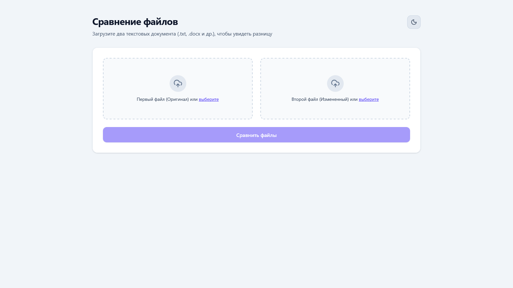
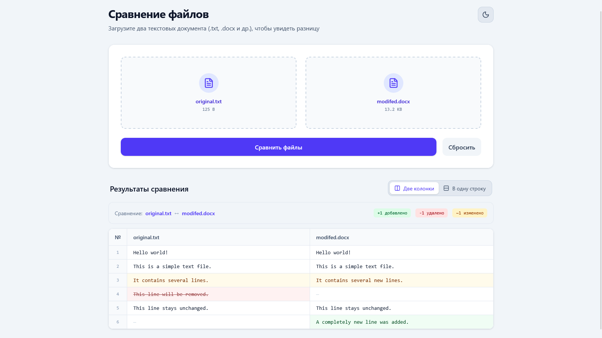
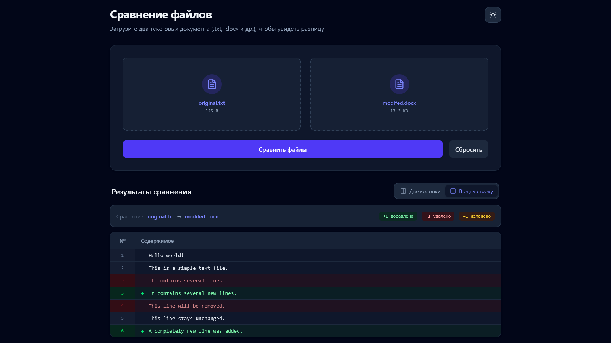
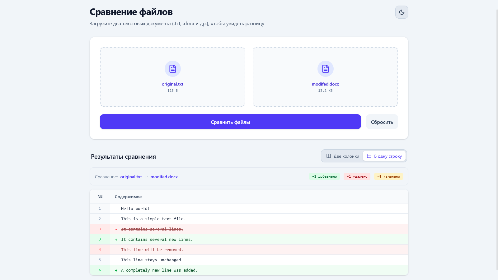

# File Comparator App


[](LICENSE)

A modern full-stack web application for comparing text-based files and visualizing their differences in a clear, readable interface.

**Live Demo:** [https://file-comparator-app.vercel.app/](https://file-comparator-app.vercel.app/)

**Repository:** [https://github.com/hypnogen/file-comparator-app](https://github.com/hypnogen/file-comparator-app)

---

## Overview

File Comparator allows users to upload two files, compare their contents line by line, and inspect the differences in an interactive interface.

The application supports multiple text-based formats, including `.txt`, `.docx`, `.md`, `.json`, `.csv`, source code files, and more.

The project was built as a full-stack application to demonstrate practical experience with **React, TypeScript, FastAPI, file processing, REST APIs, and deployment**.

---

## Features

* Compare two files directly in the browser
* Drag-and-drop file uploading
* Support for multiple text-based formats
* `.docx` document parsing
* `.docx` table extraction
* Line-by-line difference detection
* Detection of:

  * **Added** lines
  * **Removed** lines
  * **Modified** lines
  * **Unchanged** lines
* Split comparison view
* Inline diff view
* File names displayed in comparison results
* Comparison statistics
* Light and dark themes
* File type validation
* File size validation
* Loading and error states
* Responsive interface
* Production deployment with Vercel

---

## Screenshots

### Main Interface

<!-- Add screenshot here -->



### Comparison Results

<!-- Add screenshot here -->



### Dark Mode

<!-- Add screenshot here -->



### Split View

<!-- Add screenshot here -->


### Inline View

<!-- Add screenshot here -->



---

## Tech Stack

### Frontend

| Technology       | Purpose                           |
| ---------------- | --------------------------------- |
| **React**        | User interface                    |
| **TypeScript**   | Type-safe development             |
| **Vite**         | Development server and build tool |
| **Tailwind CSS** | Styling and responsive layout     |
| **Lucide React** | Interface icons                   |

### Backend

| Technology      | Purpose                   |
| --------------- | ------------------------- |
| **Python**      | Backend development       |
| **FastAPI**     | REST API                  |
| **python-docx** | `.docx` parsing           |
| **difflib**     | File comparison algorithm |
| **Uvicorn**     | ASGI server               |

### Deployment

| Technology          | Purpose                       |
| ------------------- | ----------------------------- |
| **Vercel**          | Production deployment         |
| **Vercel Services** | Frontend + FastAPI deployment |

---

## How It Works

The application is divided into two services: a React frontend and a FastAPI backend.

### 1. File Selection

The user selects two files using the drag-and-drop areas or the native file picker.

Before a file is selected, the frontend validates:

* File extension
* Maximum file size

The current maximum file size is **10 MB per file**.

### 2. Upload

The frontend creates a `FormData` object containing both files and sends them to:

```text
POST /api/compare
```

### 3. File Processing

The FastAPI backend validates the uploaded files again.

Text files are decoded using several supported encodings, while `.docx` files are parsed using `python-docx`.

For Word documents, the backend extracts both paragraphs and table contents while preserving their order within the document.

### 4. Difference Detection

The backend uses Python's `difflib.SequenceMatcher` to compare the two sequences of lines.

Each result is classified as:

```text
Unchanged
Modified
Added
Removed
```

The backend also calculates comparison statistics:

```json
{
  "additions": 0,
  "deletions": 0,
  "modifications": 0
}
```

### 5. Visualization

The frontend receives the comparison result as JSON and renders it using `DiffViewer`.

Users can switch between two visualization modes:

**Split View**

Displays both files side by side.

**Inline View**

Displays changes as a continuous diff, similar to the format commonly used by version control systems.

---

## Supported File Types

The application currently supports:

```text
.txt
.docx
.md
.markdown
.json
.csv
.xml
.yaml
.yml
.py
.js
.ts
.jsx
.tsx
.html
.css
```

Maximum file size:

```text
10 MB per file
```

---

## Project Architecture

```text
file-comparator-app/
│
├── frontend/
│   ├── src/
│   │   ├── components/
│   │   │   ├── Controls.tsx
│   │   │   ├── DiffViewer.tsx
│   │   │   ├── DropZone.tsx
│   │   │   ├── Header.tsx
│   │   │   ├── ThemeToggle.tsx
│   │   │   └── ViewModeToggle.tsx
│   │   │
│   │   ├── hooks/
│   │   │   └── useFileCompare.ts
│   │   │
│   │   ├── types/
│   │   │   └── diff.ts
│   │   │
│   │   ├── App.tsx
│   │   └── main.tsx
│   │
│   ├── package.json
│   └── vite.config.ts
│
├── backend/
│   ├── main.py
│   └── requirements.txt
│
├── screenshots/
│   ├── main.png
│   ├── comparison.png
│   ├── dark-mode.png
│   ├── split-view.png
│   └── inline-view.png
│
├── .gitignore
├── LICENSE
├── README.md
└── vercel.json
```

---

## Frontend Structure

### `components/`

Contains reusable UI components.

* `DropZone.tsx` — file selection and drag-and-drop handling
* `DiffViewer.tsx` — renders comparison results
* `ThemeToggle.tsx` — switches between light and dark themes
* `ViewModeToggle.tsx` — switches between Split and Inline views
* `Header.tsx` — application header
* `Controls.tsx` — comparison controls

### `hooks/`

Contains application-specific React hooks.

`useFileCompare.ts` manages:

* Selected files
* API requests
* Comparison results
* File names
* Statistics
* Loading state
* Error state
* Reset functionality

### `types/`

Contains shared TypeScript interfaces.

`diff.ts` defines the data structures used between the frontend and backend, including comparison results, individual differences, statistics, and view modes.

---

## Backend Structure

The backend is implemented as a FastAPI application.

The main API endpoint is:

```text
POST /api/compare
```

It accepts two uploaded files:

```text
file1
file2
```

and returns a JSON response containing:

* Comparison status
* Original file names
* Difference statistics
* Individual line differences

Example response structure:

```json
{
  "status": "success",
  "file1_name": "original.txt",
  "file2_name": "modified.txt",
  "stats": {
    "additions": 2,
    "deletions": 1,
    "modifications": 3
  },
  "differences": [
    {
      "line_number": 1,
      "file1": "Original line",
      "file2": "Modified line",
      "type": "Modified"
    }
  ]
}
```

---

## Local Development

### Prerequisites

Make sure you have installed:

* Node.js
* npm
* Python 3.10+
* Git

### Clone the repository

```bash
git clone https://github.com/hypnogen/file-comparator-app.git
cd file-comparator-app
```

### Frontend

Navigate to the frontend directory:

```bash
cd frontend
```

Install dependencies:

```bash
npm install
```

Start the development server:

```bash
npm run dev
```

The frontend will normally be available at:

```text
http://localhost:5173
```

### Backend

Open another terminal and navigate to the backend:

```bash
cd backend
```

Create a virtual environment:

```bash
python -m venv venv
```

Activate it on Windows:

```powershell
venv\Scripts\activate
```

On Linux/macOS:

```bash
source venv/bin/activate
```

Install Python dependencies:

```bash
pip install -r requirements.txt
```

Start the FastAPI server:

```bash
uvicorn main:app --reload
```

The API will normally be available at:

```text
http://127.0.0.1:8000
```

FastAPI's interactive API documentation is available at:

```text
http://127.0.0.1:8000/docs
```

---

## API

### `POST /api/compare`

Compares two uploaded files.

#### Request

Multipart form data:

```text
file1: File
file2: File
```

#### Successful response

```json
{
  "status": "success",
  "file1_name": "file1.txt",
  "file2_name": "file2.txt",
  "stats": {
    "additions": 1,
    "deletions": 1,
    "modifications": 2
  },
  "differences": []
}
```

#### Error response

```json
{
  "status": "error",
  "message": "..."
}
```

The API returns appropriate HTTP status codes for validation and server errors.

---

## Deployment

The application is deployed on **Vercel** using separate frontend and backend services.

The project uses `vercel.json` to route requests between the two services:

```text
/          → frontend
/api/*     → backend
```

This allows the frontend to communicate with the backend using the same origin:

```text
/api/compare
```

instead of requiring a separate public API URL.

### Production

**Live application:** https://file-comparator-app.vercel.app/

---

## Design Goals

The interface was designed around a few principles:

* Keep the comparison process simple
* Make differences immediately recognizable
* Avoid unnecessary UI elements
* Provide clear visual feedback
* Support both compact and detailed comparison workflows
* Work comfortably on different screen sizes
* Provide a consistent light/dark experience

The Split and Inline modes are designed for different use cases: Split View is useful when directly comparing two versions, while Inline View provides a more compact overview of changes.

---

## Error Handling & Validation

The application performs validation on both the client and server.

### Frontend validation

The file upload component checks:

* Supported file extensions
* Maximum file size

Invalid files are rejected before being uploaded.

### Backend validation

The API independently validates:

* File extension
* File size
* File readability
* `.docx` integrity
* Text encoding

This prevents the backend from relying solely on client-side validation.

---

## Limitations

The current version focuses on line-based text comparison.

Some limitations include:

* Binary files are not supported.
* `.docx` formatting is not compared.
* Images and other embedded Word objects are not compared.
* Differences inside a line are not highlighted character by character.
* Large files may require significant processing time depending on their contents.
* The comparison algorithm operates on lines rather than semantic document structure.

These limitations are intentional for the current scope of the project.

---

## Future Improvements

Possible improvements include:

* Character-level difference highlighting
* More precise line numbering for both files
* Syntax highlighting for source code
* Support for additional document formats
* Export comparison results
* Copyable diff output
* Search within comparison results
* Collapsible unchanged sections
* Improved handling of large files
* More advanced `.docx` structure comparison
* Persistent comparison history

---

## What This Project Demonstrates

This project demonstrates practical experience with:

* React component architecture
* TypeScript type definitions
* Custom React hooks
* REST API integration
* File uploads using `FormData`
* Python backend development
* FastAPI
* `.docx` document processing
* Text encoding handling
* Line-based diff algorithms
* Client-side and server-side validation
* Responsive UI development
* Dark mode implementation
* Error and loading state management
* Full-stack application architecture
* Production deployment

---

## License

This project is licensed under the MIT License.

---

<p align="center">
  Built with React, TypeScript, FastAPI and Python.
</p>
